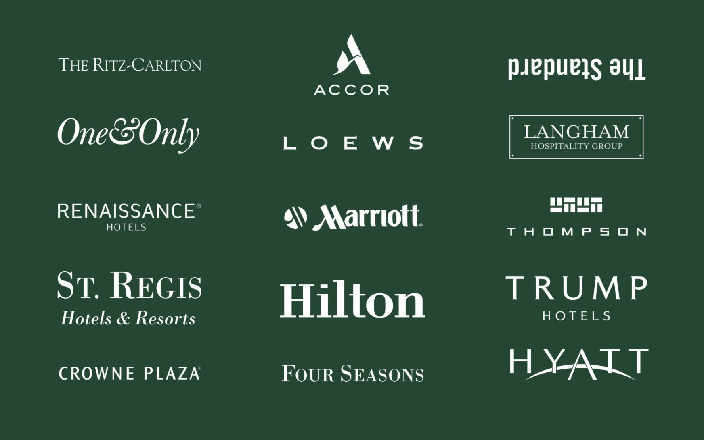

# {{ $frontmatter.title }}

> The Sound Rise II is designed for use in HOME or HOTEL environments. If you are an individual consumer using the Sound Rise II in your own home, please select HOME mode by setting the slide switch on the back of the unit to HM. If you are a hospitality establishment installing the Sound Rise II in your guest rooms, select HOTEL mode by setting the slide switch to HTL.

## The Award Winning Alarm Clock Re-Crafted

Sound Rise II is an ideal beside alarm clock and wireless speaker to complement a modern lifestyle at your room. Sound Rise II comes with the award-winning sound quality of our original Sound Rise plus various refreshing new features, bigger display screen and more versatile USB charging options. You can enjoy your favourite songs with balanced audio while lying in bed. The contemporary and upright design with small footprint takes up minimal space leaving ample room on the nightstand.

### Sound Performance

- Custom designed monophonic driver for balanced audio with vocal clarity
- Passive radiator for better bass reproduction
- Optimized volume level for hotel room (70% of full volume) <Badge type="tip" text="Hotel feature" />

### Features

- Dual top-facing high power USB smart charging ports (Type-C and Type-A)
- QC3.0 compliant rear USB port for quick charging of connected devices
- Nature Sound — producing soothing sound for relaxing, focus and deep sleep (Bird, Forest, Ocean, Rain, Urban and Chime)
- Rotary Knobs for convenient volume control, tuning and alarm setting
- Battery-free backup for clock time and user settings
- Bluetooth Wireless Speaker to stream music from your mobile devices
- Digital FM Radio with preset stations
- Full alarm clock features with snooze and gradual wake up volume
- Wake up to built-in chime only <Badge type="tip" text="Hotel feature" />
- Single Alarm Clock with Ascending Alarm and 12/24 hour setting
- Sleep Timer
- Display Dimmer
- DST (Daylight Saving Time) Setting
- 3.5mm AUX-in jack
- **Safe touch** — Antimicrobial plastics for keypad and controls
- **Metal speaker grill** for easy disinfection
- **Fire-retarded plastic** casing for safety

### Hotel Accessories Kit <Badge type="tip" text="Hotel feature" />

- 3 power plug types: US (type A)/EU (type C)/UK (type G)
- Rear port cover
- Stainless steel security lanyard
- Screws for rear port cover, 2 pcs
- Screws for security lanyard, 2 pcs
- 3.5mm AUX IN audio cable
- Installation Instructions (for hotel staff)

## Why Hotels Love It

- Elevate your guests experience with Soundfreaq Sound Rise II — the perfect blend of style, functionality, and exceptional sound quality
- Delight your guests with the immersive sound experience of Soundfreaq Sound Rise II — the ideal choice for hospitality properties seeking to create a memorable stay

## Worldwide Installations of Sound Rise II

- [Montage's Signature Harvest Homes](https://montageresidenceshealdsburg.com/harvest-homes/)
- [St Julien Hotel & Spa - In Boulder, Colorado](https://stjulien.com/)
- [Le Meridien Delfina Santa Monica Hotel](https://www.marriott.com/en-us/hotels/laxdm-le-meridien-delfina-santa-monica/overview/)
- [Kemah Boardwalk Inn](https://www.kemahboardwalkinn.com/)
- [KIMPTON HOTEL ENSO - SAN FRANCISCO](https://www.ihg.com/kimptonhotels/hotels/us/en/enso-hotel-san-francisco-ca/sfobc/hoteldetail)
- [KIMPTON HOTEL THETA - NEW YORK](https://www.ihg.com/kimptonhotels/hotels/us/en/theta-hotel-new-york-ny/nycea/hoteldetail)
- [KIMPTON SCHOFIELD HOTEL - CLEVELAND](https://www.ihg.com/kimptonhotels/hotels/us/en/theta-hotel-new-york-ny/nycea/hoteldetail)
- [The Carlin Breckenridge](https://thecarlinbreckenridge.com/)
- [Silverton Casino Lodge - Las Vegas](https://silvertoncasino.com/)
- [The St. Regis - Marriott, San Francisco](https://www.marriott.com/en-us/hotels/sfoxr-the-st-regis-san-francisco/overview/)
- [The St. Regis - Marriott, Cairo](https://www.marriott.com/en-us/hotels/caixr-the-st-regis-cairo/overview/)
- [JW Marriott - Atlanta Buckhead](https://www.marriott.com/en-us/hotels/atljw-jw-marriott-atlanta-buckhead/rooms/)
- [THE HERMOSA INN - In Arizona's Paradise Valley](https://www.hermosainn.com/)
- [Hotel Santa Barbara, California](https://www.hotelsantabarbara.com)
- [Ironworks Hotel, Indianapolis](https://www.ironworkshotel.com/)
- [The George Hotel - Christchurch, New Zealand](https://www.thegeorge.com/)
- [Novotel Phnom Penh BKK 1 - Phnom Penh, Cambodia](https://www.novotelphnompenhbkk1.com/)
- [Novotel Sihanoukville Holiday Resort - Sihanoukville, Cambodia](https://www.novotelsihanoukville.com/)
- [PMI Hotel - Austin Texas](https://www.pmihotels.net/)
- [Sentinel Hotel Portland](https://www.sentinelhotel.com/)

### Start Hotels

