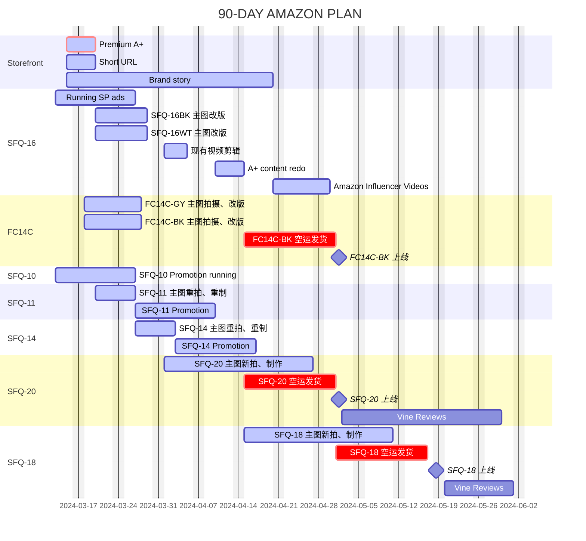

## 店铺链接

[SOUNDFREAQ 品牌旗舰店 - 新店](https://www.amazon.com/stores/page/FE18C78B-18B6-464A-8F57-31797167B505)  
[SOUNDFREAQ 品牌旗舰店 - 新店](https://www.amazon.com/stores/SOUNDFREAQ/page/FE18C78B-18B6-464A-8F57-31797167B505)  
[Soundfreaq 品牌旗舰店 - 旧店](https://www.amazon.com/stores/Soundfreaq/page/05F51731-A886-44C5-9D60-7983ADD84EA2)  
[Soundfreaq Store Profile Page](https://www.amazon.com/sp?seller=A1ZU3V2ZXZ5QHR&marketplaceID=ATVPDKIKX0DER)  
[Soundfreaq Products](https://www.amazon.com/s?me=A1ZU3V2ZXZ5QHR&marketplaceID=ATVPDKIKX0DER)

## 运营目标

1. 增加曝光量
2. 提升转化率

| Month | Sound Rise II | Actual | Sound Spot II | Actual | Charge Rise II | Actual |
| ----- | ------------- | ------ | ------------- | ------ | -------------- | ------ |
| 01    | 64            | 30     | 0             | 0      | 0              | 0      |
| 02    | 50            | 28     | 0             | 0      | 0              | 0      |
| 03    | 50            | 58     | 0             | 0      | 0              | 0      |
| 04    | 100           | 121    | 0             | 0      | 0              | 0      |
| 05    | 200           | 183    | 0             | 0      | 50             | 0      |
| 06    | 200           | 107    | 50            | 0      | 50             | 0      |
| 07    | 300           | 127    | 100           | 0      | 100            | 0      |
| 08    | 200           | 0      | 100           | 0      | 100            | 0      |
| 09    | 200           | 0      | 200           | 0      | 200            | 0      |
| 10    | 250           | 0      | 250           | 0      | 250            | 0      |
| 11    | 250           | 0      | 250           | 0      | 250            | 0      |
| 12    | 500           | 0      | 500           | 0      | 500            | 0      |
| Total | 2,314         | 0      | 1,450         | 0      | 1,500          | 0      |

## 运营策略

- Amazon 站内运营为主，Amazon 站外（社交媒体）种草为辅
- Q1 以 **图片+文字** 为主，Q2 逐渐增加 **视频** 内容

## JAN

### 优化

- [x] Soundfreaq 店铺 装修升级
- [x] SFQ-16 商品详情页 A+ content

### 广告

- [x] SFQ-10 | SFQ-11 | SFQ-14 promotion
- [x] sfq10 | SP | Seasonal campaign | Manual keywords
  - [x] SFQ-10 | Keyword targeting
- [x] SFQ-11 | SP | Seasonal campaign | Manual keywords
  - [x] SFQ-11 | Keyword targeting
- [x] SFQ-10 | SP | Seasonal Campaign | Manual products
- [x] SFQ-11 | SP | Seasonal Campaign | Manual products

## FEB

### 优化

品牌旗舰店

- [x] 2024/02/06 [Soundfreaq Store](https://www.amazon.com/stores/page/FE18C78B-18B6-464A-8F57-31797167B505) 上线
- [x] 2024/02/20 Incorrect byline links reported, Amazon Store Support
  1. agreed to try to revise the links, and
  2. suggested to contact Amazon Brand Registry
- [x] 2024/02/23 Incorrect byline links fixed by Amazon Resolution Specialist
- [x] 2024/03/05 [Soundfreaq Store 店铺后台](https://advertising.amazon.com/builder?entityId=ENTITYLLOC1KH6H4PA) 无法登陆
- [x] 2024/03/05 [Soundfreaq Store 店铺后台](https://advertising.amazon.com/builder?entityId=ENTITYLLOC1KH6H4PA) 联系客服已解决

商品详情页

- 付费拍片建议 2024/02/08 rejected，现有相片 + 相片自拍，优化如下产品 (postponed to March for implementation)

  - [ ] SFQ-11 商品详情页 A+ content
  - [ ] SFQ-14 商品详情页：主图重拍、 A+ content
  - [ ] FC14C-GY 商品详情页：主图重拍、 A+ content

### 广告

创建广告

- [x] sfq16 | SP | Regular Campaign | Manual keywords
  - [x] SFQ-16 | Keyword targeting
- [x] SFQ-16 | SP | Regular Campaign | Manual products

## MAR

品牌旗舰店

- [x] 02-06 Store Brand: SOUNDFREAQ ~~vs Soundfreaq~~
- [x] 03-08 Dangerous goods review - exemption sheet uploaded (SFQ-10/11/14)
- [x] 03-14 Store short URL: amazon.com/soundfreaq/
- [ ] 03-15 Brand Story - design draft & placeholder uploaed...to be replaced with new designs
- [x] 03-15 to acquire access to Premium A+ template
- [ ] 03-01 Store pages: re-reading on text content

商品详情页

- [ ] ~~Vine Voice SFQ-16 (19 reviews @4.1 stars)~~
- [x] 03-07 Grafting/Merging SFQ-16 on SFQ-08 (475 reviews @4.3 stars)
- [x] 03-12 Fixing Incorrect Category of FC14C
- [x] 03-12 Virtual Bundles SFQ-16 + FC14C-GY ($99.99 + $20)
- [x] 03-12 Virtual Bundles SFQ-16WT + FC14C-GY ($99.99 + $20)
- [x] 04-09 FC14C-BK (20 units FBA) Amazon launch online,
- [x] 04-10 Virtual Bundles SFQ-16 + FC14C-BK ($99.99 + $20)

- [x] 03-05 03-12 SFQ-17 A+ content creation
- [ ] 03-18 SFQ-16 主图 01 done; 主图 02-07 redesign? size=1200w x 1500h; guideline=主图 01-05 白底图; 主图 06-07 lifestyle 场景图
- [ ] 03-18 SFQ-16 A+ content redesign? 根据 Premium A+ 尺寸重新制作、参考设计调研、设计思路、
- [ ] 03-25 Update a Product FC14C-GY （灰色）商品详情页：主图重拍、 A+ content
- [ ] 03-25 Add a Product FC14C-BK （黑色）商品详情页：主图重拍、 A+ content
- [ ] 03-19 SFQ-16 videos

Shipment

- [ ] 04-15 SFQ-20, black/white, 50 units each, initial shipment from Shenzhen to FBA
- [ ] 04-15 FC14C-BK, black, 20 units, initial shipment from Shenzhen to FBA
- [ ] 03-25 Sound Rise II 库存 - 补货逻辑和计划 （SFQ-16）Monitor & Standby

New Product Launch

- [ ] 03-25 Add a Product SFQ-20 SY-W0219（黑色/白色）商品详情页：主图重拍、 A+ content
- [ ] 04-30 Product SFQ-20 SY-W0219（黑色/白色）launch online, Amazon go live
- [ ] 04-30 Vine Enrollment for SFQ-20 SY-W0219

Advertising

- Sound Rise II 优化和投放 MAR/APR/MAY = 50/100/150

  - Title/Bullet points/Main image updated
  - Budget MAR/APR/MAY = \$1800/\$3600/\$3600

- [ ] 03-13 Title/Bullet points/Main image, redo then run ads - last for two weeks, to be reviewed weekly

  - Keyword targeting
  - Brand targeting
  - Product targeting

- [ ] 03-25 SD 广告 策划：通过 SD 广告 第二次触达 - 先前之 SP 广告 受众

Promotions

旧库存 处理计划 （SFQ-10/11/14）

- [ ] 03-13 SFQ-10 商品详情页：现有页面不变，降价至 $32.99 促销一周
- [ ] 03-20 SFQ-11 商品详情页：主图重拍、重制
- [ ] 03-27 SFQ-14 商品详情页：主图重拍、重制

Amazon Posts (Image/Video)

- [ ] 04-01 帖子主题策划（贴子频次、图片尺寸规格要求、文字内容撰写要求、贴子发布审核流程）
- [ ] 04-01 Amazon Affiliate Program

Conclusion

- Budget=\$1800
- Spend=\$952
- ACOS=28.19%
- Orders=36/74

## APR

Photo/Video shooting

- [ ] Charge Rise II SFQ-20 相片拍摄
- [ ] Charge Rise II SFQ-20 视频拍摄
- [ ] SFQ-16 现有视频剪辑 + 英文字幕
- [ ] 脚本策划、视频拍摄 - 横屏（SFQ-18/20）
- [ ] 产品单张印刷（SFQ-18/20）
- [ ] PR agent for new product launch - Gadi Ponte
- [ ] 03-15 起，A/B Test for SFQ-16 （主图+文字，白底图 vs 场景图）
- [ ] Amazon Influencer Program, Sound Rise II=5 [Sample Cost=\$200; Bedget=\$300]

**Premium A+ is now launched on Seller Central!**  
To get access to this feature:

1. All of the Brand Owned ASINs in your catalog must contain published A+ Brand Story A+ Brand Story
2. You must have at least 5 A+ Content project submissions in "Approved" status within the past 12 months
   Note: Access to Premium A+ is now given to all world wide marketplaces once eligibility is met. Enrollment to Premium A+ is granted every Friday. You will be notified if you meet the criteria and will not need to contact us for access.
   [Learn more about Premium A+](https://sellercentral.amazon.com/help/hub/reference/G202102930)

Conclusion (04-15)

- Budget=\$1800
- Spend=\$1147.73
- ACOS=36.27%
- Orders=40/61

## MAY

`Electronics >> Portable Audio & Video >> Portable Speakers & Docks >> Portable Bluetooth Speakers`

- [ ] Sound Spot II SFQ-18 相片拍摄，10 组
- [ ] Sound Spot II SFQ-18 视频拍摄，10 组
- [ ] 05-10 Add a Product: SFQ-18
- [ ] 05-20 Vine Enrollment for SFQ-18
- [ ] Remote Fulfillment with FBA (Canada, Mexico, Brazil)
- [ ] 营销节点 2024 H2

### 优化

to be substantialized...

## JUN

### 优化

## JUL

Prime Day (July 9 - 10)

- SFQ-16: \$99 >> \$79
- SFQ-16 + SFQ-10: $119 >> \$99

## OCT

Prime Day 2 (Date?)

## Key Milestones and Schedule

